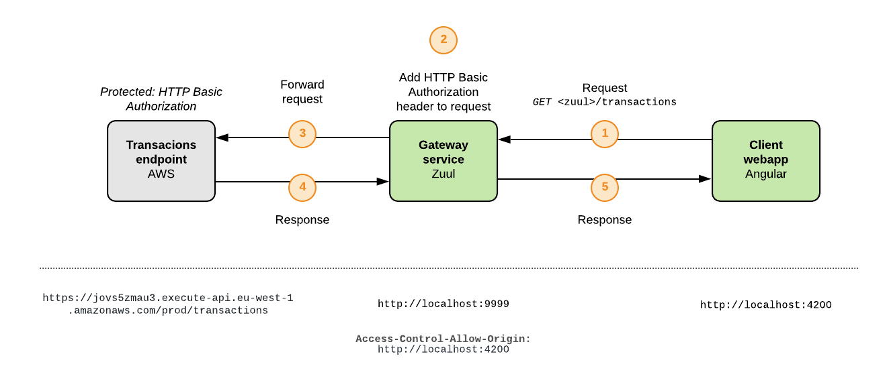

# Challenge

[Challenge description](https://github.com/payvision-development/recruitment-challenges/tree/fullstack-engineer)

# High level system description

There are 3 _actors_ in the system:

* Client webapp: Angular webapp
* Gateway service: Netflix Zuul
* Transactions endpoint in AWS

The **transactions endpoint** is provided in challenge. This endpoint is secured with HTTP Basic credentials

These credentials should be never exposed in **client webapp application**. This is why a **gateway service** is located between transactions endpoint and webapp.

This gateway service adds the authentication header to requests made by client webapp, so webapp does not know anything about transactions endpoint authentication.

In addition, gateway service supports CORS allowing only client webapp origin

Why a gateway and not a _middleware_ service in charge of receiving client webapp requests and call to transactions endpoint adding auth header and processing the response to send it to client webapp?

Well, this is something about **responsibility** and **scalability**.

The _responsibility_ to provide data is for transactions endpoint. Adding a direct **dependency** between transactions endpoint and a _middleware_ service is a bad idea. This is an unnecessary **coupling**. 

Is this service going to implement its own mirror data domain and validations? Yes, no? What happens if data domain changes? Refactor? Anyway, this is not a good solution.

In terms of _scalability_, having a gateway in our system to orchestrate transactions endpoint and other future services is a better solution, scalable and powerful.

# Modules description

For detailed informationa about agteway service and client webapp follow the links below

See **Gateway Service** documentation:

[Gateway README](./zuul-gateway)

See **Client WebApp** documentation:

[Webapp README](./webapp)
