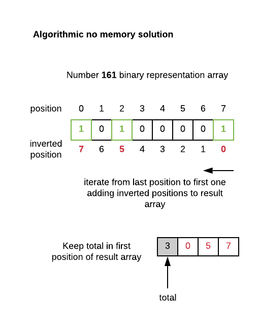

# Introduction 
See challenge instructions on the PDF.

# Getting Started
Install the dependencies by running `npm install`

# Build and Test
Run the tests using `npm test`

**NEW**: Test coverage: `npm run test-coverage`

# Linting
If you want, you can lint your code using `npm run lint`

Good luck!

# Solution

I implemented 4 different approaches, it means, solutions for this challenge

* **Standard**: This would be my first approach in a real complex application using JS native `Array` functions such as `reverse`, `reduce` and `unshift`. Easy to implement and good enough if best performance implementation is not a _hard requirement_

* **Algorithmic**: Better performance approach
    
    * **No memory**: Problem solved without extra memory usage (_no space complexity added_)
    
    * **Memory**: Problem solved using extra memory (_space complexity added_). This solution has **better time complexity** than _No memory_ solution in the _best case scenario_, and **the same time complexity** than _No memory_ solution in the _worst case scenario_. Keep in mind that **this solution adds space complexity** using a `stack` structure

* **Mathematical**: Above solutions are based in manipulation of the Number Bits Array obtained from `(input >>> 0).toString(2)`. This mathematical solution calculates Number Bits through JS native `Math` functions and composes result _on the fly_ without using input to binary array representation 

## Best solution
_Algorithmic.Memory_ solution is the **best average solution** in terms of _time complexity_. Note that this solution adds _space complexity_

## Project scaffolding

Before talking deeper about solutions, let me describe repository structure and scaffolding

I made some modifications to project scaffolding in order to have a coherent and clean code structure

```
src/
   positiveBitCounter/
      algorithmic/
      mathematical/
      standard/
      test/
   util/
   validator/
.gitignore
package.json
README.md
```

* `src`: source code

* `src/positiveBitCounter`: folder holds 4 different solutions

* `src/positiveBitCounter/test`: All 4 solutions are tested with same tests. This folder contains tests definitions as well as test runner. Duplicated code is not an option :)

* `src/util`: Contains `NumberUtil.ToBinaryArray` function used in standard and algorithmic solutions

* `src/validator`: Contains `NumberValidator.Positive` function used in all solutions

## Tests
All **tests** are located next to source code. All source code is tested including utility & support functions. More tests added to original ones to cover more cases

**Test coverage** (_Istanbul_) support added

| #tests | coverage |
| :----- | :------- |
| 48 | 100% |

## Code style

* CamlCase

* Arrow function `f(() => {})` notation preferred to regular function notation `f(function(){})`

## Development environment

* MacOS 10.14.3
* Node v11.10.0
* Npm 6.7.0
* IntelliJ


## Solutions discussion

Input binary array representation and result array will not be considered in solution space complexity calculation

### 1. Standard solution

[PositiveBitCounterStandard.js](src/positiveBitCounter/standard/PositiveBitCounterStandard.js)

Solution through array operations pipeline

* Validate input (`type numeric && value >= 0`)
* Transform input to array of bits: `NumberUtil.ToBinaryArray(input)`
* `Reverse` array
* `Reduce` array
  * if array position `i === 1` add `i` to result array
* Add at the beginning of result array (`unshift`) the size of the result array

`N`: Size of number bits array

**Time complexity**: N `Array.reverse` + N (`Array.reduce`) + N `Array.unshift` ~= `O(3N)` ~= `O(N)` **Linear**

**Space complexity**: No auxiliar structures in solution = `O(1)`

### 2. Algorithmic no extra memory

[PositiveBitCounterAlgorithmicNoMemory.js](src/positiveBitCounter/algorithmic/PositiveBitCounterAlgorithmicNoMemory.js)

Algorithmic solution treating input binary array representation

Input validation included (`type numeric && value >= 0`)

First position of result array is _reserved_ for total number of positive bits. This position will be updated lately. This is done to avoid unshift operation when adding total to first position

See picture below describing strategy



### 3. Algorithmic with extra memory

Algorithmic solution treating input binary array representation and using an auxiliar _stack_ structure

Input validation included (`type numeric && value >= 0`)

First position of result array is reserved for total number of positive bits. This position will be updated lately. This is done to avoid unshift operation when adding total to first position

See picture below describing strategy

[PositiveBitCounterAlgorithmicMemory.js](src/positiveBitCounter/algorithmic/PositiveBitCounterAlgorithmicMemory.js)


### 4. Mathematical

Mathematical solution decomposing number to have its binary representation

Input validation included (`type numeric && value >= 0`)

To get the number of bits of number binary representation before starting iterations:

```
Math.floor(Math.log2(input)) + 1
```

First position of result array is reserved for total number of positive bits. This position will be updated lately. This is done to avoid unshift operation when adding total to first position

See picture below describing strategy

[PositiveBitCounterMathematical.js](src/positiveBitCounter/mathematical/PositiveBitCounterMathematical.js)


